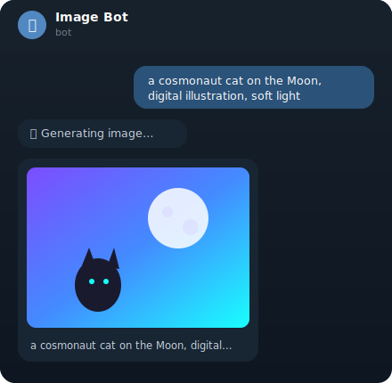

# OpenAI Image Telegram Bot

> Отправляешь текстовое описание в Telegram — за пару секунд получаешь сгенерированную картинку.

Небольшой, но «продакшен-ориентированный» Telegram-бот, который превращает текст — или текст плюс
**референс-фото** — в изображения через **OpenAI Images API** (по умолчанию `gpt-image-2`). Написан
на `aiogram 3`, полностью асинхронный, с инлайн-меню `/settings` (формат / качество / модель),
персональными настройками, whitelist-доступом и историей генераций в SQLite.

[](https://github.com/chigerartem/openai-image-telegram-bot/actions/workflows/ci.yml)
[](https://www.python.org/)
[](https://docs.aiogram.dev/)
[](https://github.com/astral-sh/ruff)
[](LICENSE)

🇬🇧 [English README](README.md)

---

## Демо

<!-- Плейсхолдер-макет. Замени на реальный скриншот/GIF: положи картинку в docs/demo.png и поправь src. -->
<p align="center">
  
</p>

```
Ты:   космонавт-кот на Луне, цифровая иллюстрация, мягкий свет
Бот:  🎨 Генерирую изображение…
Бот:  [картинка]  космонавт-кот на Луне, цифровая иллюстрация, мягкий свет
```

---

## Возможности

- **Текст → картинка одним сообщением.** Просто опиши, что хочешь.
- **Референсы (image-to-image).** Прикрепи фото с подписью — бот использует его как референс через
  эндпоинт `images.edit` (то, чего обычный `generate` не умеет).
- **Выбор формата.** `1:1`, `3:2`, `2:3`, `16:9`, `9:16`, `Auto` или **своё разрешение** вида
  `1920×1080`. Широкие и кастомные размеры получаются генерацией ближайшего нативного формата и
  обрезкой/подгоном через Pillow.
- **Инлайн-меню `/settings`.** Кнопки для формата, качества, модели и силы референса — без правки
  `.env` и перезапуска.
- **Персональные настройки** в SQLite — у каждого пользователя свои формат/качество/модель.
- **Контроль доступа по whitelist.** Можно ограничить бота конкретными Telegram ID (или открыть всем).
- **История генераций в SQLite.** Каждая попытка — успешная или с ошибкой — пишется в БД; миграции версионируются и применяются один раз.
- **Понятные ошибки.** Отказ модерации, превышение лимитов и проблемы доступа к модели переводятся в человеческие сообщения.
- **Полностью асинхронный** стек (`aiogram` + `AsyncOpenAI` + `aiosqlite`).
- **Готов к контейнеру.** В комплекте — лёгкий `Dockerfile` с запуском от непривилегированного пользователя.

## Как пользоваться

| Что отправляешь | Что делает бот |
|-----------------|----------------|
| Текстовое описание | Генерирует картинку по промпту (`images.generate`) |
| Фото **с подписью** | Использует фото как референс, подпись — как инструкцию (`images.edit`) |
| `/settings` | Открывает инлайн-меню: формат · качество · модель · сила референса |

Как форматы ложатся на API: `1:1 / 3:2 / 2:3` — нативные размеры (без потерь); `16:9` и `9:16` —
центрированная обрезка из ближайшего нативного; своё `Ш×В` — генерация ближайшего нативного и
cover-crop + масштаб ровно до нужных пикселей.

---

## Архитектура

Путь одного запроса:

1. Текстовый промпт (или фото + подпись) попадает в `handlers/generate.py`.
2. `AccessMiddleware` уже проверил, что отправитель в whitelist (или whitelist пуст).
3. Пользователь апдейтится; его настройки превращаются в **план рендера**
   (`presets.plan_render` → размер API + опциональная обрезка/подгон).
4. `OpenAIImageService.generate()` (текст) или `.edit()` (с референсом) вызывает Images API и
   возвращает PNG-байты.
5. `image_processing` применяет обрезку/подгон для `16:9`, `9:16` или своего размера (вне event-loop
   через `asyncio.to_thread`).
6. Картинка уходит обратно как фото; попытка логируется в `image_generations`.

### Структура проекта

```
app/
├── main.py                  # точка входа — сборка и запуск бота (long polling)
├── config.py                # неизменяемый Config из .env
├── presets.py               # таблицы форматов/качества/моделей + план рендера
├── keyboards.py             # инлайн-меню для /settings
├── handlers/
│   ├── commands.py          # /start, /help
│   ├── settings.py          # меню /settings + колбэки + FSM ввода своего размера
│   └── generate.py          # промпт / фото-референс → картинка → ответ
├── middlewares/
│   ├── access.py            # whitelist-доступ (сообщения + кнопки)
│   └── db_session.py        # прокидывает соединение с БД в хендлеры
├── services/
│   ├── openai_image.py      # async-обёртка над images.generate + images.edit
│   └── image_processing.py  # Pillow: crop-to-ratio / fit-to-size / to-png
└── db/
    ├── database.py          # соединение + runner миграций (WAL, FK on)
    ├── repository.py        # пользователи, история и персональные настройки
    └── migrations/          # версионированные .sql, применяются один раз
tests/                       # юнит-тесты на pytest
```

---

## Быстрый старт (Windows / PowerShell)

```powershell
git clone https://github.com/chigerartem/openai-image-telegram-bot.git
cd openai-image-telegram-bot

py -m venv .venv
.\.venv\Scripts\Activate.ps1
pip install -r requirements.txt

Copy-Item .env.example .env   # затем впиши свои ключи в .env
python -m app.main
```

На macOS / Linux:

```bash
git clone https://github.com/chigerartem/openai-image-telegram-bot.git
cd openai-image-telegram-bot

python3 -m venv .venv
source .venv/bin/activate
pip install -r requirements.txt

cp .env.example .env          # затем впиши свои ключи в .env
python -m app.main
```

Чтобы запустить, нужны две вещи:

1. **Токен бота** от [@BotFather](https://t.me/BotFather).
2. **Ключ OpenAI API** с [platform.openai.com](https://platform.openai.com/api-keys).

---

## Переменные окружения (`.env`)

| Переменная        | Описание                                                            | По умолчанию       |
|-------------------|---------------------------------------------------------------------|--------------------|
| `BOT_TOKEN`       | токен бота от [@BotFather](https://t.me/BotFather)                  | — (обязательно)    |
| `OPENAI_API_KEY`  | ключ с platform.openai.com                                          | — (обязательно)    |
| `OWNER_IDS`       | Telegram ID с доступом (узнать у [@userinfobot](https://t.me/userinfobot)), через запятую | пусто = доступ всем |
| `OPENAI_MODEL`    | Модель по умолчанию для новых пользователей (каждый меняет в `/settings`) | `gpt-image-2`  |
| `DB_PATH`         | путь к файлу SQLite                                                  | `data/imagebot.db` |

> Формат, качество, модель и сила референса — **персональные** и хранятся в БД; меняются в рантайме
> через меню `/settings`, а не в `.env`.

---

## Тесты

```bash
pip install pytest
pytest
```

---

## Docker

```bash
docker build -t imagebot .
docker run --env-file .env -v "$PWD/data:/data" imagebot
```

Контейнер работает от непривилегированного пользователя и пишет базу в смонтированный том `/data`.

---

## Примечания

- Топовые image-модели у некоторых аккаунтов OpenAI требуют **верификации организации**. Если
  API вернёт ошибку доступа — поставь `OPENAI_MODEL=gpt-image-1-mini` в `.env`.
- Результат отправляется как фото Telegram (превью слегка сжимается).
- Если `OWNER_IDS` пуст, бот пишет предупреждение и пускает **всех** — укажи свой ID, чтобы закрыть доступ.

---

## Стек

`Python 3.12` · `aiogram 3` · `OpenAI Python SDK` · `aiosqlite` (SQLite + WAL) · `python-dotenv` · `Docker`

## Лицензия

[MIT](LICENSE) © Artem
